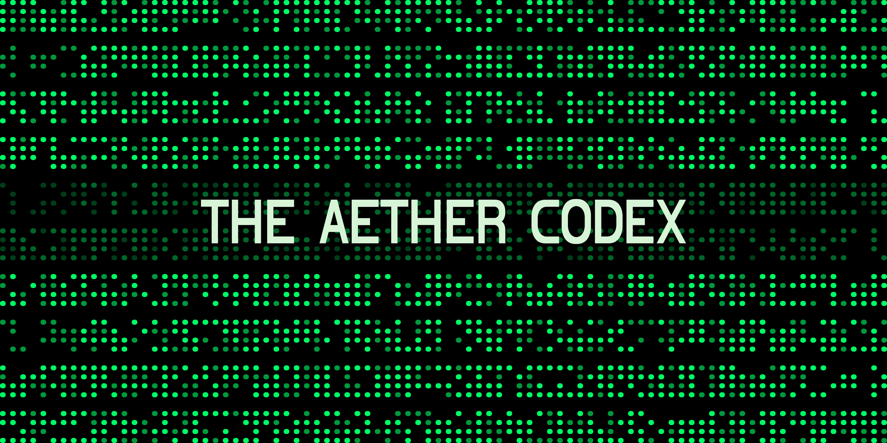

# The Aether Codex

The Aether Codex is a collection of notes, official media, and publications describing technologies or events from 2021-2099 as retrieved by the founder. The documents are all written in ARIEL (Abstract Relational Information Exchange Language). You will need to acquire Visual Cortex enhancements and L3 Precognition to alleviate combinatorial explosion. Your crystals should ideally have between 3 to 10 XBs available during the translation.

This preview version is heavily truncated to avoid exceeding the maximum repository size limits.

## Table of Contents

- [Chapter 0: Preface (2099)](./chapter-0/DATA)
- [Chapter 1: Prometheus (2078)](./chapter-1/DATA)
- [Chapter 2: Bubble Wear (2036)](./chapter-2/DATA)
- [Chapter 3: Black Goat Leak (2027)](./chapter-3/DATA)
- [Chapter 4: Prosthetics (2032)](./chapter-4/DATA)
- [Chapter 5: ARSC-650 (2084)](./chapter-5/DATA)
- [Chapter 6: ARSC-958 (2092)](./chapter-6/DATA)
- [Chapter 7: Alicia's Gift (2052)](./chapter-7/DATA)
- [Chapter 8: Origin (2098)](./chapter-8/DATA)
- [Chapter 9: Gatekeeper VI (2099)](./chapter-9/DATA)

## Contributions

This repository does not accept third-party contributions to the source material.

## License

Licensed under Creative Commons Attribution 4.0 International.
